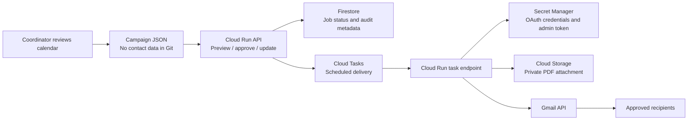

# Community Calendar & Email Automation

A production-oriented reference implementation for turning a reviewed meeting calendar into reliable, privacy-conscious reminder emails. It was designed to eliminate repetitive manual scheduling while preserving a human approval step before any message is queued.

> **Portfolio note:** This public repository is a sanitised reconstruction of a real operational workflow. It contains no real member data, personal addresses, calendar files, OAuth credentials, tokens, cloud project identifiers, or live service URLs.

## The problem

Volunteer coordinators receive a larger calendar containing meetings for several groups. Their work is to select relevant events, identify the right audience, create a local calendar, and send reminders three and one day before each meeting. Manual delivery is slow, error-prone, and hard to audit.

This service provides the delivery layer after a human has reviewed the calendar and campaign data.

## What it does

- Validates recipients, subjects, and attachment metadata before a job is accepted.
- Renders accessible HTML and plain-text meeting reminders.
- Stores a durable record of each email job and its current delivery state.
- Uses Cloud Tasks to deliver messages at a precise future time, with retries.
- Sends through the account owner's Gmail using OAuth and the Gmail API.
- Reads secrets only at runtime from Secret Manager.
- Allows edits only while a job is queued; recipient edits require an explicit approval flag.
- Supports private PDF attachments stored in Cloud Storage.

## Architecture at a glance



Read [the developer guide](docs/developer-guide.md) for the complete explanation, [the project log](docs/project-log.md) for key delivery decisions, and [the evaluation plan](docs/evaluations.md) for how reliability was measured.

## Offline demo and verification

Requires Node.js 22. No installation or credentials are needed for the preview:

```sh
npm run demo
npm test
```

Open `demo-output/reminder.html` to inspect a fictional reminder. The `.eml` file shows the MIME alternatives. Nothing is queued or sent. Tests cover recipient validation, header injection, escaped event content, and plain-text/HTML MIME structure.

This demo, tests and provenance notes were newly added on September 25, 2026. The delivery service was recovered from the existing personal project. See [PROVENANCE.md](PROVENANCE.md) and [docs/DEMO.md](docs/DEMO.md).

## Offline demo and verification

Requires Node.js 22. No installation or credentials are needed for the preview:

```sh
npm run demo
npm test
```

Open `demo-output/reminder.html` to inspect a fictional reminder. The `.eml` file shows the MIME alternatives. Nothing is queued or sent. Tests cover recipient validation, header injection, escaped event content, and plain-text/HTML MIME structure.

This demo, tests and provenance notes were newly added on September 25, 2026. The delivery service was recovered from the existing personal project. See [PROVENANCE.md](PROVENANCE.md) and [docs/DEMO.md](docs/DEMO.md).

## Safe local setup

1. Copy `.env.example` to `.env` and replace only the placeholders for a non-production test project.
2. Install Node.js 22 or later.
3. Run `npm install`.
4. Run `npm run check` to validate the service source.
5. Deploy only after configuring managed secrets, IAM roles, and a private attachment bucket as described in the developer guide.

## Reliability limits

Cloud Tasks, Firestore and Gmail integration were not exercised in this reconstruction. The send endpoint relies on correct Cloud Run IAM/OIDC configuration, not an application-layer bearer check. Do not expose the cloud service publicly without configuring that protection. A successful Gmail send followed by a failed status write can cause a retry to send twice; this is not exactly-once delivery. Batch scheduling is sequential and may partially succeed if a later cloud call fails. The evaluation document is a plan, not measured test results.

## Reliability limits

Cloud Tasks, Firestore and Gmail integration were not exercised in this reconstruction. The send endpoint relies on correct Cloud Run IAM/OIDC configuration, not an application-layer bearer check. Do not expose the cloud service publicly without configuring that protection. A successful Gmail send followed by a failed status write can cause a retry to send twice; this is not exactly-once delivery. Batch scheduling is sequential and may partially succeed if a later cloud call fails. The evaluation document is a plan, not measured test results.

## Repository boundaries

The code is suitable as a learning and portfolio reference. It is not a contact-management system and does not parse a calendar itself. A coordinator or upstream calendar-processing workflow prepares the approved campaign payload.

## License

No license has been selected. All rights reserved unless the repository owner adds a license.
