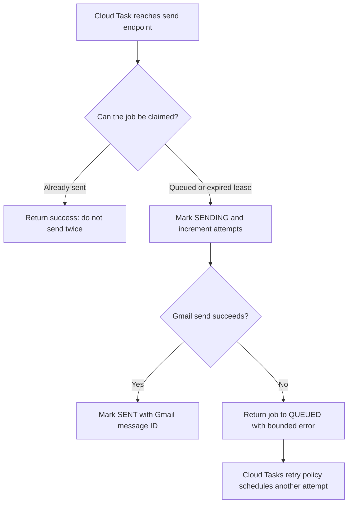
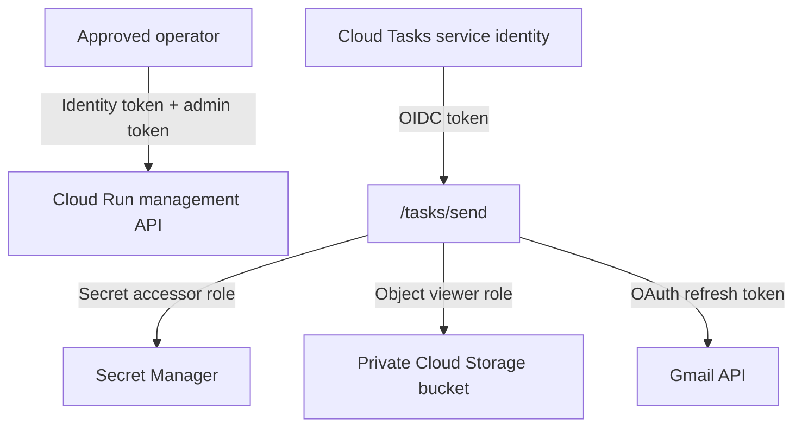

# Developer guide

## 1. Plain-English overview

Think of the system as a carefully controlled mailroom. A coordinator checks the message before it is accepted. The service records the approved message, sets a timed reminder to deliver it, and lets Gmail perform the actual sending. If the service is temporarily unavailable, the timer retries instead of silently losing the reminder.

The automation is deliberately split into small services. That makes it easier to understand, test, and secure each responsibility.

## 2. Components and responsibilities

| Component | What it does | Why it matters |
| --- | --- | --- |
| Campaign preparation | Converts reviewed meeting details into an email payload | Keeps calendar interpretation and final approval human-controlled. |
| Cloud Run API | Receives previews, approvals, edits, and task callbacks | Provides one protected entry point for the workflow. |
| Firestore | Stores job status, schedule time, subject, counts, audit fields, and errors | Makes delivery observable and prevents a restart from losing work. |
| Cloud Tasks | Waits until the scheduled time, then calls the service | Provides durable timing and retries. |
| Secret Manager | Stores OAuth details and the administrative token | Keeps secrets outside source code and source control. |
| Cloud Storage | Holds optional private PDF attachments | Keeps large files out of the database and out of requests. |
| Gmail API | Sends the MIME email using the authorised Gmail account | Uses the account owner's normal mailbox and delivery rules. |

## 3. End-to-end delivery flow

```mermaid
sequenceDiagram
  participant C as Coordinator
  participant API as Cloud Run API
  participant DB as Firestore
  participant Q as Cloud Tasks
  participant S as Secret Manager
  participant G as Gmail API

  C->>API: Request preview with email and future time
  API->>API: Validate recipients and content
  API-->>C: Subject, recipient counts, scheduled time
  C->>API: Approve one job or a reviewed batch
  API->>DB: Save QUEUED job and audit metadata
  API->>Q: Create timed task
  Q->>API: Call /tasks/send at scheduled time
  API->>DB: Claim job atomically; mark SENDING
  API->>S: Read OAuth credentials at runtime
  API->>G: Send MIME message
  G-->>API: Gmail message ID
  API->>DB: Mark SENT, save delivery ID and timestamp
```

### If delivery fails



## 4. Back-end design

This is a Node.js 22 service using Express. It is intentionally a small modular backend rather than a large monolith:

| Source file | Role |
| --- | --- |
| `src/config.js` | Loads required environment configuration and rejects startup when values are missing. |
| `src/server.js` | Defines HTTP endpoints, authentication, task dispatch, and central error handling. |
| `src/jobs.js` | Validates, previews, queues, batches, and safely updates email jobs. |
| `src/store.js` | Handles Firestore persistence, atomic state transitions, and delivery audit metadata. |
| `src/gmail.js` | Loads OAuth values from Secret Manager, reads attachments, and calls Gmail API. |
| `src/email.js` | Validates email fields and produces raw MIME content for Gmail. |
| `src/templates.js` | Produces the branded HTML and text reminder body. |

There is no traditional front end. The practical interface is a review-and-approval workflow using approved JSON payloads and API responses. A future chapter-wide version can add a browser dashboard without changing the delivery service.

## 5. API reference

All management endpoints require an administrative token in `X-Admin-Token`. In production, a trusted operator also uses an authenticated Cloud Run identity token.

| Method and path | Use | Important behavior |
| --- | --- | --- |
| `GET /health` | Health check | Reports whether the container is running. |
| `POST /jobs/preview` | Validate one potential reminder | Does not save or schedule anything. |
| `POST /jobs` | Approve and schedule one email | Stores job then creates a timed Cloud Task. |
| `POST /jobs/batch` | Approve a campaign of up to 50 emails | Validates all messages before creating jobs. |
| `GET /jobs` | View delivery metadata | Shows status, counts, time, attempts, and last error; not recipient addresses or bodies. |
| `PATCH /jobs/batch` | Edit queued messages | Rejects changes after sending; recipient changes need `allowRecipientChanges: true`. |
| `POST /tasks/send` | Internal delivery callback | Claims a job, sends it, then records outcome. |

### Example payload shape

```json
{
  "approvedBy": "coordinator",
  "sendAt": "2030-01-01T14:00:00.000Z",
  "email": {
    "subject": "Community | Saturday activities",
    "cc": ["leader@example.org"],
    "bcc": ["member@example.org"],
    "textBody": "Plain-text fallback.",
    "htmlBody": "<p>Accessible HTML message.</p>",
    "attachments": [
      {
        "object": "calendars/month.pdf",
        "filename": "community-calendar.pdf",
        "contentType": "application/pdf"
      }
    ]
  }
}
```

## 6. Data model and safeguards

Each Firestore `sendJobs` record contains a status such as `QUEUED`, `SENDING`, `SENT`, or `SCHEDULE_FAILED`; schedule time; approval identity; subject; recipient **counts**; attempts; timestamps; task name; and bounded error messages. The full email payload is stored only in the private operational database.

The `claim` transaction prevents duplicates. A job marked `SENT` cannot be sent again. A `SENDING` lease expires after ten minutes so a task can safely retry after an interrupted request.

## 7. Security model



Recommended practices:

- Keep contact lists and generated documents outside Git.
- Store secrets only in Secret Manager; never in environment files committed to Git.
- Use separate identities for task invocation and email delivery.
- Make Cloud Run private; only allow the task invoker to call the send endpoint.
- Apply least-privilege IAM roles.
- Treat home addresses and meeting details as sensitive operational data.
- Rotate OAuth credentials immediately if exposed and redeploy after the new secret version is active.

## 8. Operational checklist

Before scheduling: validate event details, eligibility, recipient counts, time zone, attachment, and message preview.

After scheduling: confirm each job is `QUEUED`, inspect the scheduled timestamp, and retain a review export without recipient addresses.

After delivery: confirm `SENT` and Gmail message ID. Investigate `lastError` and retry attempts before assuming a reminder was delivered.

## 9. Cost model

For small volunteer communications volumes, Cloud Run, Firestore, Cloud Tasks, Secret Manager, and Cloud Storage usage is typically low and often within free or near-free usage ranges. Costs depend on region, request volume, storage, and current provider pricing. Set a billing budget alert and check the current cloud pricing before deploying.

## 10. Roadmap for chapter-wide automation

The next project can add: a secure campaign editor, recipient-group management, district rules, approval roles, calendar extraction with human review, audit dashboards, and automated daily delivery-health alerts. The delivery core here remains reusable.
